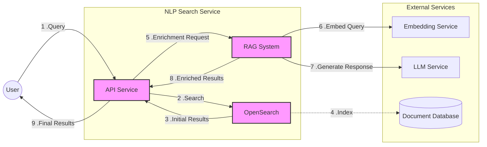
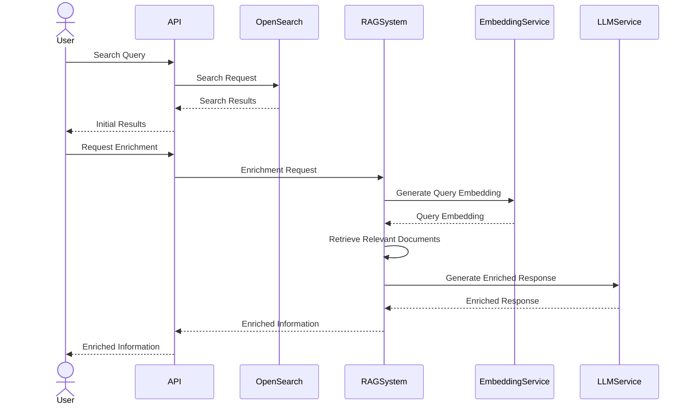

# NLP Search Service


This project provides an NLP-powered search service that combines OpenSearch capabilities with a RAG (Retrieval-Augmented Generation) system for enriched information retrieval.

## Table of Contents

- [Features](#features)
- [System Overview](#system-overview)
- [Prerequisites](#prerequisites)
- [Installation](#installation)
- [Configuration](#configuration)
- [Usage](#usage)
- [API Endpoints](#api-endpoints)
- [RAG System](#rag-system)
- [Sequence Diagram](#sequence-diagram)
- [Docker Deployment](#docker-deployment)

## Features

- Search information in OpenSearch database
- Enrich search results with additional context using RAG system
- Locally served LLM and embedding models
- Easy to deploy and expand


## System Overview

The following diagram provides an overview of the NLP Search Service architecture and information flow:



This diagram illustrates the main components of the NLP Search Service and the flow of information:

1. **User**: Initiates the process by submitting a query.
2. **API Service**: The central component that manages the flow of information between other components.
3. **OpenSearch**: Handles initial search requests based on the indexed documents.
4. **RAG System**: Manages the enrichment process, coordinating with the Embedding and LLM services.
5. **Embedding Service**: Generates embeddings for queries and documents.
6. **LLM Service**: Generates enriched responses based on the retrieved documents and user query.
7. **Document Database**: Stores the indexed documents for searching.


## Prerequisites

- Python 3.10+
- Docker 20.10+ and Docker Compose 1.29+
- OpenSearch instance
- GPU with CUDA 11.3+ support (recommended for faster LLM and embedding model inference)
- Minimum 8GB VRAM for optimal performance

## Installation

1. Clone the repository:
   ```
   git clone https://github.com/yourusername/nlp-search-service.git
   cd nlp-search-service
   ```

2. Create a virtual environment and activate it:
   ```
   python -m venv venv
   source venv/bin/activate 
   ```

3. Install the required packages:
   ```
   pip install -r requirements.txt
   python -m spacy download en_core_web_sm
   ```

4. Copy the `.env.example` file to `.env` and update the environment variables:
   ```
   cp .env.example .env
   ```

## Configuration

Update the `.env` file with your specific configuration:

```
OPENSEARCH_URL=http://localhost:9200
OPENSEARCH_USERNAME=admin
OPENSEARCH_PASSWORD=admin
LLM_SERVICE_URL=http://llm-service:8001
EMBEDDING_SERVICE_URL=http://embedding-service:8002
```

## Usage

1. Ensure that the LLM and embedding model services are running and accessible.

Ingest documents into the vector database:
   ```
   python scripts/ingest_documents.py /path/to/your/documents
   ```

2. Run the API server:
   ```
   uvicorn api.main:app --reload
   ```

3. Access the API documentation at `http://localhost:8000/docs`

## API Endpoints
- `GET /search`: Search for information in the OpenSearch database
- `POST /enrich`: Enrich search results with additional context using 
the RAG system

### Search Endpoint

- **URL**: `/search/{collection_name}`
- **Method**: `GET`
- **Path Parameters**:
  - `collection_name` (string, required): The name of the collection to search in
- **Query Parameters**:
  - `query` (string, required): The search query
  - `limit` (integer, optional, default=10): Number of results to return (1-100)
- **Headers**:
  - `X-Request-ID` (string, optional): Unique request ID for tracing
- **Response**:
  - `200 OK`: Successful response
    ```json
    {
      "request_id": "string",
      "results": [
        {
          "id": "string",
          "title": "string",
          "content": "string"
        }
      ]
    }
    ```
  - `500 Internal Server Error`: Server error

### Enrich Endpoint

- **URL**: `/enrich`
- **Method**: `POST`
- **Headers**:
  - `X-Request-ID` (string, optional): Unique request ID for tracing
- **Request Body**:
  ```json
  {
    "query": "string"
  }
  ```
- **Response**:
  - `200 OK`: Successful response
    ```json
    {
      "request_id": "string",
      "enriched_response": "string"
    }
    ```
  - `500 Internal Server Error`: Server error

For detailed API documentation and interactive testing, refer to the Swagger UI at `http://localhost:8000/docs`.

## RAG System

The Retrieval-Augmented Generation (RAG) system enhances search results by combining the strengths of retrieval-based and generation-based approaches. It retrieves relevant documents based on the query, then uses a language model to generate an informative response that incorporates both the query context and the retrieved information.

## Sequence Diagram

The following sequence diagram illustrates the flow of interactions in the NLP Search Service:



This diagram shows the following steps:
1. User sends a search query to the API
2. API searches OpenSearch and returns initial results
3. User requests enrichment
4. API uses the RAG Service 
5. RAG System retrieves relevant documents via Embedding
6. LLM Service generates an enriched response from relevant documents
7. API returns the enriched information to the user

## Docker Deployment

To deploy the service using Docker:

1. Build the Docker image:
   ```
   docker-compose build
   ```

2. Start the services:
   ```
   docker-compose up -d
   ```

3. To stop the services:
   ```
   docker-compose down
   ```

4. To stop the services and remove all associated volumes:
   ```
   docker-compose down -v
   ```

Note: Make sure to update the `docker-compose.yml` file to include the external LLM and Embedding services.

